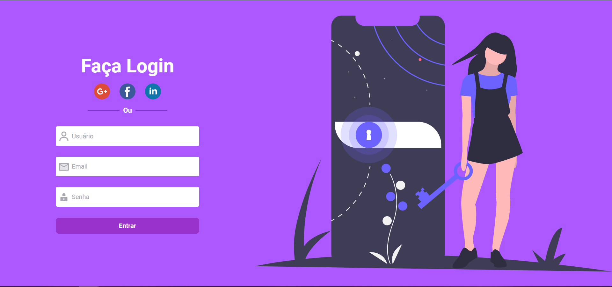

# Login_Screen




> Eu fiz esse projeto para treinar alguns conceitos de flex blox e pra treinar o Styled Components.
> 
## Linguagens utilizadas

- [SASS](https://sass-lang.com/)
- [HTML](https://developer.mozilla.org/pt-BR/docs/Web/HTML)
- [JavaScript](https://developer.mozilla.org/pt-BR/docs/Web/JavaScript)

## 🚀 Instalando o login_Screen

Para instalar o login_Screen, siga estas etapas:

Linux, macOS e Windows:
```
git clone https://github.com/Nikolas-as/login_Screen.git

cd login_Screen

yarn dev
```
## 🤝 Colaboradores

Agradecemos às seguintes pessoas que contribuíram para este projeto:

<table>
  <tr>
    <td align="center">
      <a>
        <br>
        <sub>
          <b>Nikolas-as</b>
        </sub>
      </a>
    </td>
</table>
